# Young people these days
David Hood

(note, this is the easier to read md version which github displays as a
webpage. To see the R analysis code check the README.qmd version of the
file)

In the wake of the current German election, there has been discussion
about decades long trends in changes in voting behaviour in not just
Germany, but in countries like the US and UK. If you place people on a
left right spectrum (which I personally am not entirely comfortable as a
global framing device) there are long term trends for middle-aged people
moving right and 18-30 moving to extremes, and those young men and women
moving in very different directions.

New Zealand does not have the full population voting demographic data of
Germany, but does have the New Zealand Election Study which includes
both voting information and values questions.

https://dataverse.ada.edu.au/dataverse.xhtml?alias=new-zealand-election-study

For New Zealand, I personally don’t think the detailed party vote is
useful- we know that about 29% are changed their party vote at the 2017
election, and given the sample sizes I think a cohort/party model loses
that inter-election complexity (and that it can matter). There is a lot
going on not captured in the basic percentages.

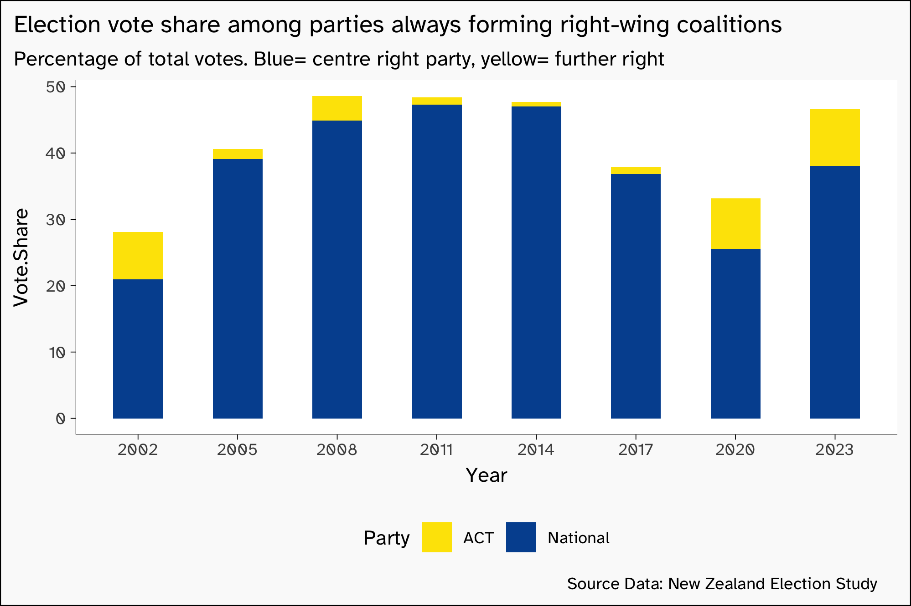

People in New Zealand should be looking at that graph and going “but
that has to be understood in relation to other parties (not shown) and
time in power (not shown)”. At least, that is how I react.

There is a similar issue with voter placement given vote splitting
(voting for a different party for local representative to the vote for
national parliament makeup). From around 20% of electors (elderly) to
around 40% (younger voters). This graph wasn’t custom made for this
analysis, I did it a few years ago and am just reusing it.

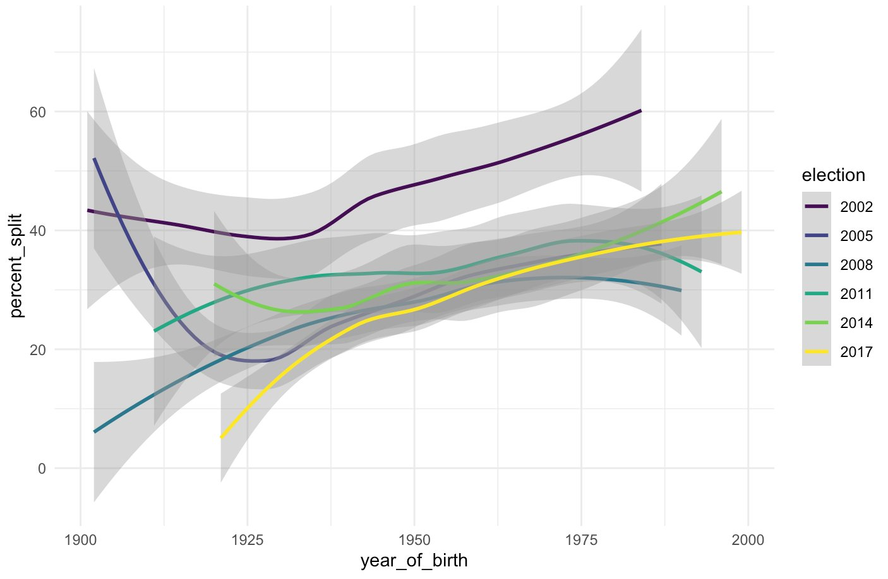

But there are lots of other, I think more useful, questions that step
around this multiple vote issues etc.

## The boring technical summaries

To make it easier for anyone replicating these splits by age, gender,
and election year, here are relevant field from the data.

Table 1: Fields for ages

| varnames | eyear | descriptions              |
|:---------|------:|:--------------------------|
| WNAGE    |  2002 | age in years              |
| YAGE     |  2005 | Age in Years              |
| ZAGE     |  2008 | age of respondent         |
| jage     |  2011 | Respondent’s age in years |
| dage     |  2014 | Age in Years              |
| rsamage  |  2017 | F2: Age in Years          |
| lage     |  2020 | Age in Years Sample       |

Table 2: Fields for gender

| varnames | eyear | descriptions            |
|:---------|------:|:------------------------|
| WSEX     |  2002 | G1. Gender              |
| ysex     |  2005 | G1 Gender of Respondent |
| zsex     |  2008 | H1: Gender or Sex       |
| jsex     |  2011 | F1: respondent’s gender |
| dsex     |  2014 | F1: respondent’s gender |
| rsex     |  2017 | F1: respondent’s gender |
| G1       |  2020 | Sex or Gender           |

### Total entries by age, male

Table 3: Male age groups by year

| Year | under 30 | 31 to 64 | 65 plus |
|-----:|---------:|---------:|--------:|
| 2002 |      285 |     1865 |     513 |
| 2005 |      126 |     1076 |     426 |
| 2011 |      134 |      742 |     437 |
| 2014 |      114 |      654 |     477 |
| 2017 |      160 |      724 |     574 |
| 2020 |      232 |      765 |     498 |

### Total entries by age, female

Table 4: Female age groups by year

| Year | under 30 | 31 to 64 | 65 plus |
|-----:|---------:|---------:|--------:|
| 2002 |      424 |     2070 |     571 |
| 2005 |      249 |     1310 |     451 |
| 2011 |      241 |     1037 |     438 |
| 2014 |      184 |      905 |     470 |
| 2017 |      293 |     1027 |     598 |
| 2020 |      380 |     1154 |     506 |

### Total entries by age, gender diverse

Table 5: Gender Diverse age groups by year

| Year | under 30 | 31 to 64 | 65 plus |
|-----:|---------:|---------:|--------:|
| 2017 |        5 |        5 |       2 |
| 2020 |       12 |        3 |       0 |

As well as the sample sizes and interpretation of the two vote
structural issues, I would also note that gender diverse people do tend
to be disproportionately anti-fascist/authoritarian (not surprising
given how fascist/authoritarians want to treat them), so a change in
gender categories could be changing the results by a couple of percent
relative to the category counts before the gender diverse category was
available.

Given all this, I would describe the following analysis as an
“impressionist painting” level of detail- it creates an overall picture
across multiple years and difference characters, rather than making a
specific number claim as an aggregate of questions.

The thing I think it would be most useful to do further breakdowns of is
ethnic identification, but the numbers are getting small even now, the
ethnic data is limited in the NZES, and the comparitive overseas
discussion is mostly at the gender/age level anyway (rather than
regional/ethnic). So I think this is good enough for, as mentioned, an
impressionist painting.

## Ask them

One question asked every election is for people to rate themselves on a
left-right scale

Table 6: Respondent left-right self rating

| varnames | eyear | descriptions                        |
|:---------|------:|:------------------------------------|
| WLRSCLE  |  2002 | B11. Respondent on Left-Right Scale |
| ylscale  |  2005 | B9 Left to Right Scale              |
| zscale   |  2008 | C17: On Left Right Scale Respondent |
| jslflr   |  2011 | A19: yourself on left-right scale   |
| dslflr   |  2014 | B6: yourself on left-right scale    |
| rselflr  |  2017 | B6: yourself on left-right scale    |
| B8       |  2020 | Personal Left Right Placement       |

This is a 10 step scale, So I am treating Left or 1 (ordinal 1 or 2) as
far left, 9 or Right (ordinal 10 or 11) as far right, with ordinal 12
being don’t know.

Table 7: Respondent left-right 2017 choices

| order | text_in_2017    |
|------:|:----------------|
|     1 | 0\. Left        |
|     2 | 1               |
|     3 | 2               |
|     4 | 3               |
|     5 | 4               |
|     6 | 5\. Centre      |
|     7 | 6               |
|     8 | 7               |
|     9 | 8               |
|    10 | 9               |
|    11 | 10\. Right      |
|    12 | 99\. Don’t know |

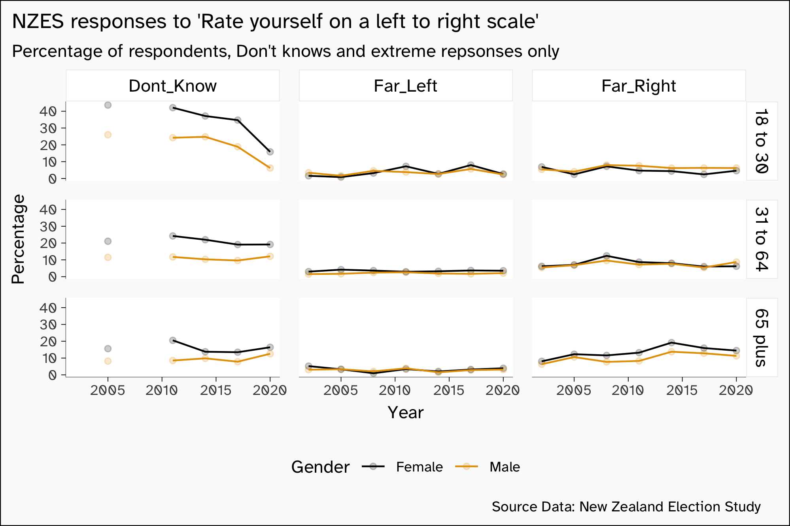

There is no particular change in self decriptors visible here over
time.Though the younger you are the less far right you tend to describe
yourself, this does not seem to vary between genders.

## Ask them, compared to

Each election study also asks respondents to rate the current parties,
so we can take the average value for the two main parties (one of who is
always been the major partner in any coalition, being decribed as a
x-lead government) and check how far they rate themselves from that “de
facto centre”. If they rate the average of the two main parties as being
in the centre, then their own position is unchanged. But if for example
they rated both main parties as communists and themselves as centrist,
then their relative (to the biggest and best known parties) position
would be to the far right.

Table 8: Respondent left-right relative rating

| varnames    | eyear | descriptions                        |
|:------------|------:|:------------------------------------|
| WLRSCLE     |  2002 | B11. Respondent on Left-Right Scale |
| WLBSCL      |  2002 | B12. Labour on Left-Right Scale     |
| WNTSCL      |  2002 | B12. National on Left-Right Scale   |
| ylscale     |  2005 | B9 Left to Right Scale              |
| ylabscl     |  2005 | b10b Placing Left Right Labour      |
| ynatscl     |  2005 | B10a Placing Left Right National    |
| zscale      |  2008 | C17: On Left Right Scale Respondent |
| zscllab     |  2008 | C16b: On Left Right Scale Labour    |
| zsclnat     |  2008 | C16a: On Left Right Scale National  |
| jslflr      |  2011 | A19: yourself on left-right scale   |
| jlablr      |  2011 | A18: Labour on left-right scale     |
| jnatlr      |  2011 | A18: National on left-right scale   |
| dslflr      |  2014 | B6: yourself on left-right scale    |
| dlablr      |  2014 | B5: Labour on left-right scale      |
| dnatlr      |  2014 | B5: National on left-right scale    |
| rselflr     |  2017 | B6: yourself on left-right scale    |
| rlabourlr   |  2017 | B5a: Labour on left-right scale     |
| rnationallr |  2017 | B5b: National on left-right scale   |
| B8          |  2020 | Personal Left Right Placement       |
| B7_1        |  2020 | Left Right Placement of Labour      |
| B7_2        |  2020 | Left Right Placement of National    |

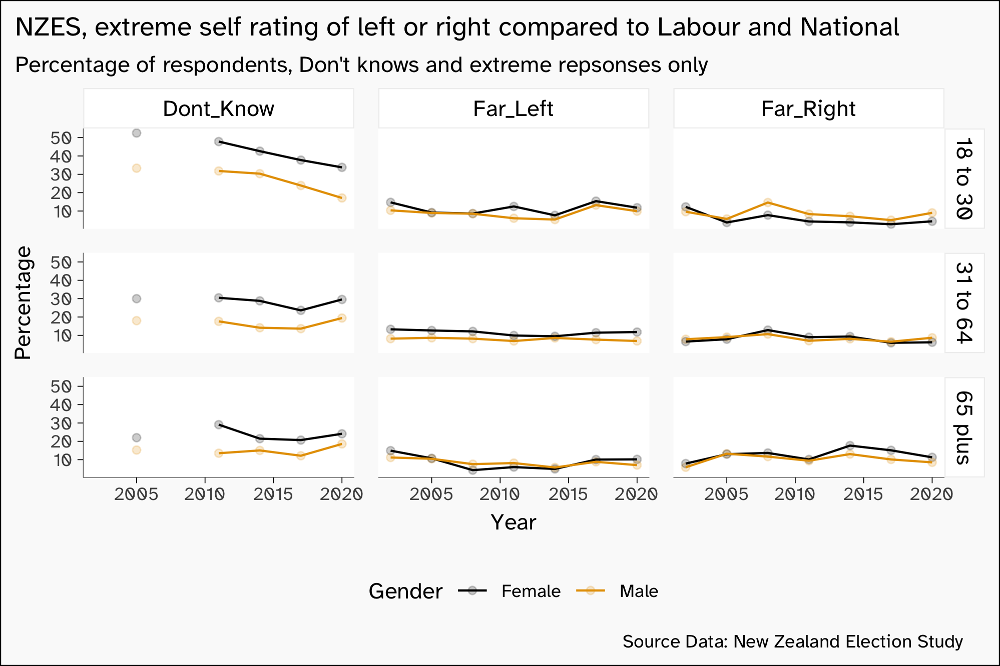

Taking this approach has raised the far left relative to the far right,
suggesting there is a constituency of people who view themselves not as
far left but do view both major parties as being right of centre. But it
doesn’t really change anything with regard to long term trens and gender
splits (there not being much happening)

## Fans of authoritarians

In my opinion, the question most suggestive of you being a fan of
authoritarism is the “A few strong leaders could make this country
better than all the laws and talk” question, which has been asked across
the years with a few variations.

Table 9: Stong leaders question details

| varnames | eyear | descriptions |
|:---|---:|:---|
| WSTRONG | 2002 | F8. A few strong leaders could make this country better than all the laws and talk |
| ystrongl | 2005 | F15b Strong Leaders Make Country Better |
| zstrong | 2008 | G9c: Strong Leaders Better |
| jleaders | 2011 | E16b: a few strong leaders could make this country better than all the laws and talk |
| dleaders | 2014 | E15b: a few strong leaders could make this country better than all the laws and talk |
| rleaders | 2017 | E15b: a few strong leaders could make this country better than all the laws and talk |
| F7_2 | 2020 | Strong Leaders Make Country Better |

Table 10: Strong Leaders 2017 choices

| order | text_in_2017          |
|------:|:----------------------|
|     1 | 1\. Strongly agree    |
|     2 | 2\. Somewhat agree    |
|     3 | 3\. Neither           |
|     4 | 4\. Somewhat disagree |
|     5 | 5\. Strongly disagree |
|     6 | 9\. Don’t know        |

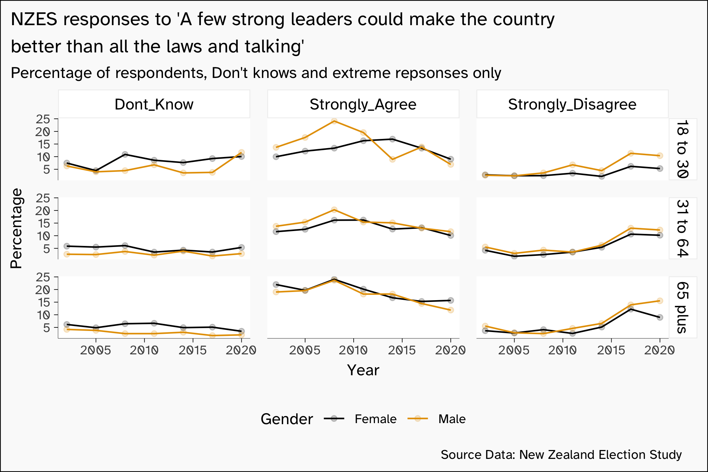

With 18-30 males being no more pro strong leaders than females of the
same age (and all ages decreasing in strong agreement), and 18 to 30
year old males be more opposed to strong leaders than females of the
same age, there is no evidence that any group is moving away from the
rule of law and talking out things.

## The trade unions have too much power question

Questions about trade union power are seen as a classic left/right
worker/capital division point

Table 11: Do unions’ have too much power

| varnames | eyear | descriptions                                |
|:---------|------:|:--------------------------------------------|
| WUNPOW   |  2002 | C17. Trade unions in NZ have too much power |
| yunpow   |  2005 | C14h Unions too Powerful                    |
| zunpow   |  2008 | D10e: Unions Too Powerful                   |
| junions  |  2011 | B6f: trade unions in NZ have too much power |
| dunions  |  2014 | C7b: trade unions in NZ have too much power |
| runions  |  2017 | C9b: trade unions in NZ have too much power |
| C18_2    |  2020 | Trade Unions Too Much Power                 |

Table 12: Do unions’ have too much power 2017 choices

| order | text_in_2017          |
|------:|:----------------------|
|     1 | 1\. Strongly agree    |
|     2 | 2\. Somewhat agree    |
|     3 | 3\. Neither           |
|     4 | 4\. Somewhat disagree |
|     5 | 5\. Strongly disagree |
|     6 | 9\. Don’t know        |

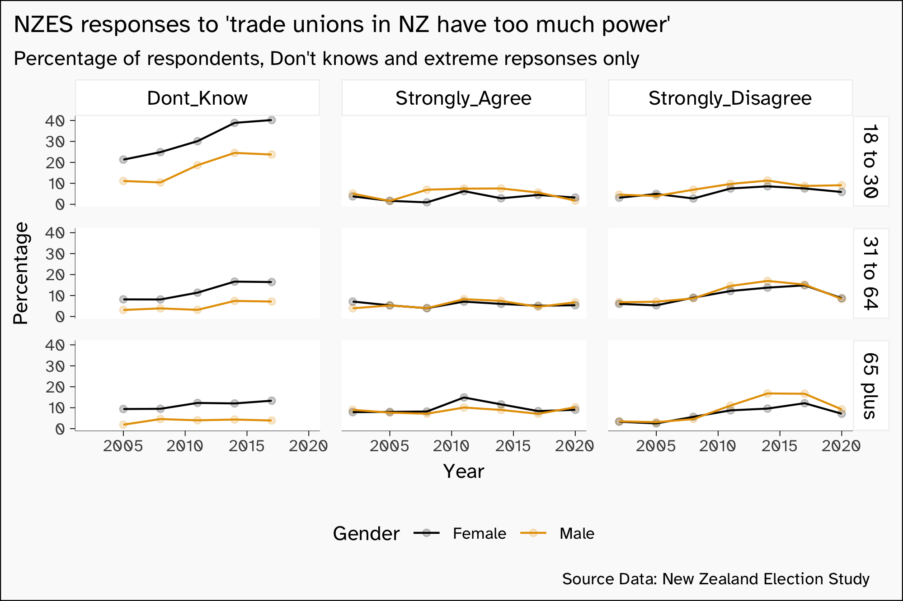

There is no detectable gender difference that has built up over the
decades on the question of union power.

## The unions are necessary question

There is a slightly different formation of the question, a are unions’
necessary to protect workers question that is worth checking as well.

Table 13: Are unions’ needed to protect workers

| varnames | eyear | descriptions                                        |
|:---------|------:|:----------------------------------------------------|
| WUNION   |  2002 | C17. Trade unions are necessary to protect workers  |
| yunprot  |  2005 | C14f Unions Necessary to Protect                    |
| zunions  |  2008 | D10c: Unions Necessary to Protect                   |
| junprot  |  2011 | B8b: trade unions are necessary to protect workers  |
| dunprot  |  2014 | C7k: trade unions are necessary to protect workers  |
| runprot  |  2017 | C10a: trade unions are necessary to protect workers |
| C22_1    |  2020 | Trade Unions Necessary                              |

Table 14: Are unions’ needed to protect workers 2017 choices

| order | text_in_2017          |
|------:|:----------------------|
|     1 | 1\. Strongly agree    |
|     2 | 2\. Somewhat agree    |
|     3 | 3\. Neither           |
|     4 | 4\. Somewhat disagree |
|     5 | 5\. Strongly disagree |
|     6 | 9\. Don’t know        |

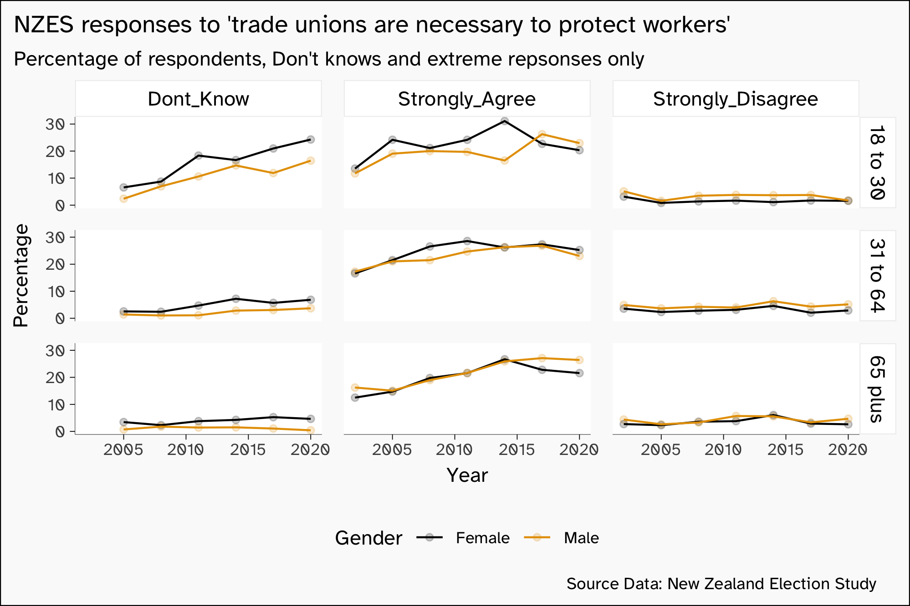

There has been a generally rising trend of strongly agreeing unions are
necessary to protect workers, while strongly disagreeing has been flat.
This trend is not noticeably different by gender or age.

## Te Tiriti o Waitangi (no 2011 entry)

It is possible to do authoritarian fascism without doing white
supremacy, as several countries around the world have been
demonstrating. But in a New Zealand context, people leaning towards
authoritarian fascism target the Treaty of Waitangi both for creating an
“other” out of Maori, and that the treaty constrains the unilateral use
of power.

Table 15: Remove Treaty from Law

| varnames | eyear | descriptions |
|:---|---:|:---|
| WTREAT | 2002 | C19. References to the Treaty of Waitangi should be removed from the law |
| ytreaty | 2005 | C12a Remove Treaty from Law |
| ztreaty | 2008 | D10a: Remove Treaty From Law |
| dtreaty | 2014 | C7l: reference to the Treaty of Waitangi should be removed from the law |
| rtreaty | 2017 | C10b: reference to the Treaty of Waitangi should be removed from the law |
| C22_2 | 2020 | Remove Treaty From Law |

Table 16: References to the Treaty of Waitangi should be removed from
the law 2017 choices

| order | text_in_2017          |
|------:|:----------------------|
|     1 | 1\. Strongly agree    |
|     2 | 2\. Somewhat agree    |
|     3 | 3\. Neither           |
|     4 | 4\. Somewhat disagree |
|     5 | 5\. Strongly disagree |
|     6 | 9\. Don’t know        |

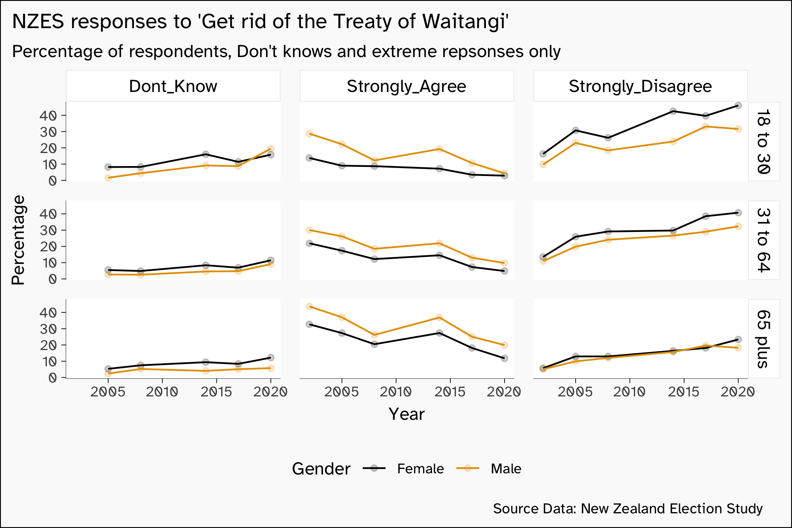

Enthusiasm for getting rid of the treaty has been decreasing for all age
groups, and while there is a gender division, it has remained pretty
constant over the last few decades.

## Spending to protect the environment (no 2008)

Ecofascism is a thing, but it doesn’t line up with more more public
spending on the environment, which lines up more with green-liberalism
and small-c conservative preservation.

Table 17: More public spending on the environment

| varnames | eyear | descriptions |
|:---|---:|:---|
| WENSPD | 2002 | C1. Spending on Protecting the environment |
| yenvspd | 2005 | C2a Spending on Environment |
| jspenviro | 2011 | B3i: should there be more or less public spending on the environment |
| dspenviro | 2014 | C4i: should there be more or less public spending on the environment |
| rspendenviro | 2017 | C5i: should there be more or less public spending on the environment |
| C14_9 | 2020 | More or less public expenditure on the Environment |

Table 18: More public spending on the environment 2017 choices

| order | text_in_2017    |
|------:|:----------------|
|     1 | 1\. Much more   |
|     2 | 2\. More        |
|     3 | 3\. Same as now |
|     4 | 4\. Less        |
|     5 | 5\. Much less   |
|     6 | 9\. Don’t know  |

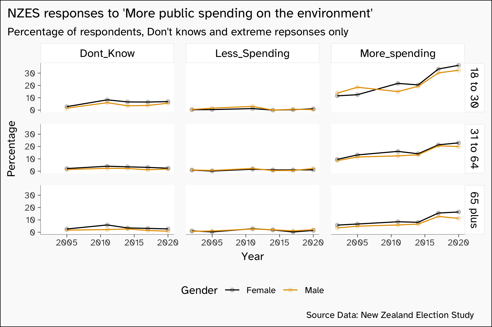

With respect to government spending on the environment, both men and
women of all ages have increasingly supported more spending.

## Favour Environment vs. development (no 2011)

Rather than a question about degree of public spending, another approach
is the balance between environmental protection (a shared
benefit/limitation) vs income/development (which has more personal
benefits)

Table 19: More public spending on the environment

| varnames | eyear | descriptions |
|:---|---:|:---|
| WENPRT | 2002 | C2. Environment Protection v. Incomes |
| yenprot | 2005 | C1 Protect Environment or Keep Incomes |
| zenvprt | 2008 | D1: Incomes Before Environment |
| decovsenv | 2014 | C8: where you stand between protecting the environment and promoting economic development |
| renvvseco | 2017 | C8: do more to protect the environment or to encourage economic development |
| C10 | 2020 | Environment Versus Development |

Table 20: More public spending on the environment 2017 choices

| order | text_in_2017                                  |
|------:|:----------------------------------------------|
|     1 | 1\. Do more to protect the environment        |
|     2 | 2                                             |
|     3 | 3                                             |
|     4 | 4                                             |
|     5 | 5                                             |
|     6 | 6                                             |
|     7 | 7\. Do more to encourage economic development |
|     8 | 9\. Don’t know                                |

This is a seven point scale rather than the 5 point of most other
questions, so there is more scope to pick something other than an
extreme.

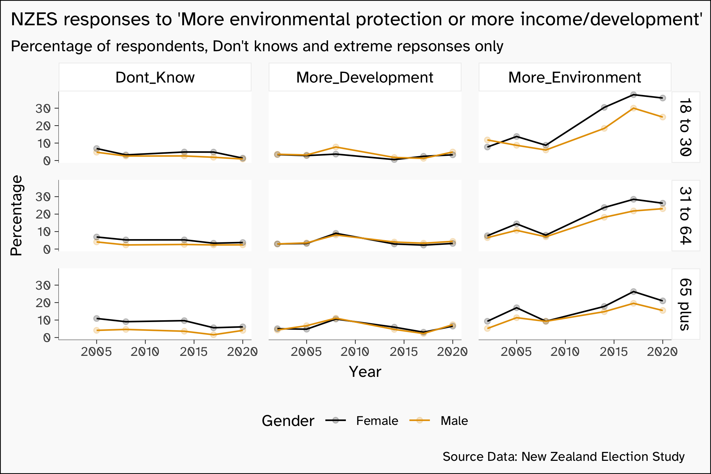

There is a gender difference in rates, but it is not changing by much
over the years, and both young men and women are increasingly favouring
the strongest possible answer on more environmental protections.

## So, Big business?

The does big business have too much power is another classic left/right
class/capitalism question.

Table 21: Does big business have too much power

| varnames | eyear | descriptions                                |
|:---------|------:|:--------------------------------------------|
| WBIGBUS  |  2002 | C17. Big business in NZ has too much power  |
| ybuspow  |  2005 | C14g Big business Too Powerful              |
| zbigbus  |  2008 | D10d: Big Business Too Powerful             |
| jbigbus  |  2011 | B6c: big business in NZ has too much power  |
| dbigbus  |  2014 | C7m: big business in NZ has too much power  |
| rbigbus  |  2017 | C10d: big business in NZ has too much power |
| C22_4    |  2020 | Big Business Too Much Power                 |

Table 22: Does big business have too much power 2017 choices

| order | text_in_2017          |
|------:|:----------------------|
|     1 | 1\. Strongly agree    |
|     2 | 2\. Somewhat agree    |
|     3 | 3\. Neither           |
|     4 | 4\. Somewhat disagree |
|     5 | 5\. Strongly disagree |
|     6 | 9\. Don’t know        |

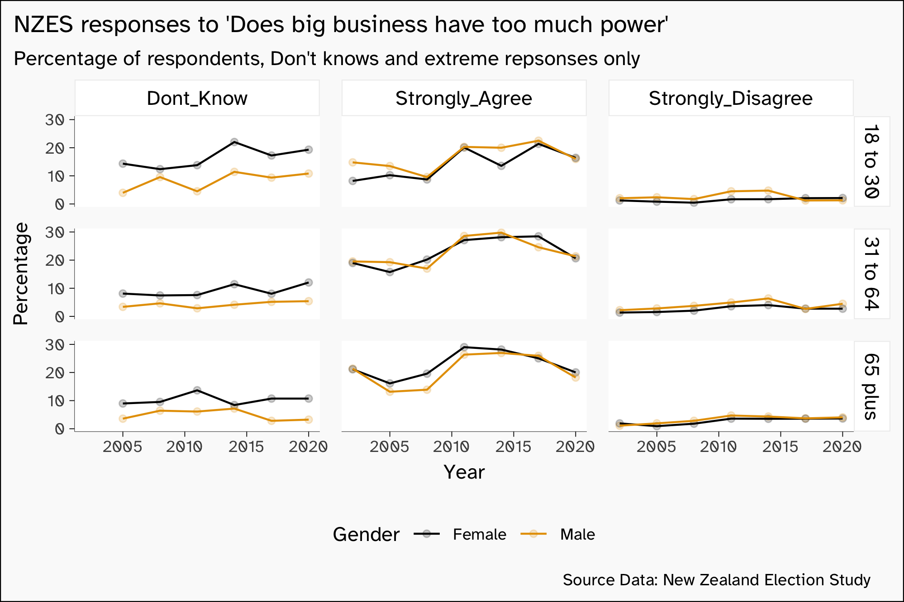

# Government should provide a job for everyone who wants one

A question about the scope of the state

Table 23: Government should provide a job for everyone who wants one

| varnames | eyear | descriptions |
|:---|---:|:---|
| ygovjob | 2005 | C15a Government Provide Jobs |
| zgovjob | 2008 | D14a: Government Responsible for Jobs |
| jgovjob | 2011 | B7a: government should provide a job for everyone who wants one |
| rjobsforall | 2017 | C14a: should government provide a job for everyone that wants one? |
| C21_1 | 2020 | Government Responsible For Providing Jobs |

Table 24: Government should provide a job for everyone who wants one
2017 choices

| order | text_in_2017              |
|------:|:--------------------------|
|     1 | 1\. Definitely should     |
|     2 | 2\. Should                |
|     3 | 3\. Should not            |
|     4 | 4\. Definitely should not |
|     5 | 9\. Don’t know            |

This is a 4 point scale, so has less opportunity to pick a non-extreme
result

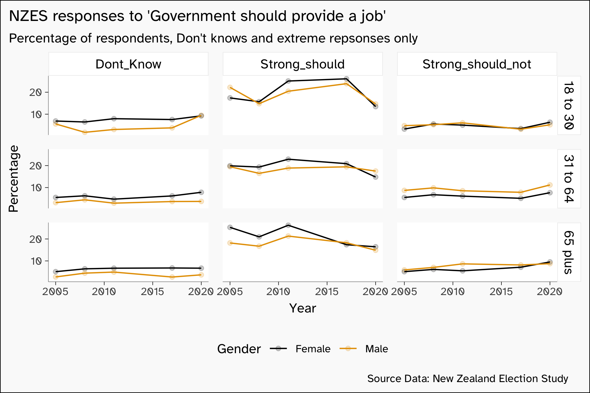

There is no particular divergence by gender.

## ladies better in the home

A question only asked a few times, but at the start and end of the data
period.

Table 25: Society would be better off if more women stayed home with
their childre

| varnames | eyear | descriptions |
|:---|---:|:---|
| WSTAYHM | 2002 | C12. Society would be better off if more women stayed home with their children |
| rwomenathome | 2017 | C10f: society would be better off if women stayed home with their children |
| C22_6 | 2020 | Women Should Stay Home With Children |

Table 26: Society would be better off if more women stayed home with
their children 2017 choices

| order | text_in_2017          |
|------:|:----------------------|
|     1 | 1\. Strongly agree    |
|     2 | 2\. Somewhat agree    |
|     3 | 3\. Neither           |
|     4 | 4\. Somewhat disagree |
|     5 | 5\. Strongly disagree |
|     6 | 9\. Don’t know        |

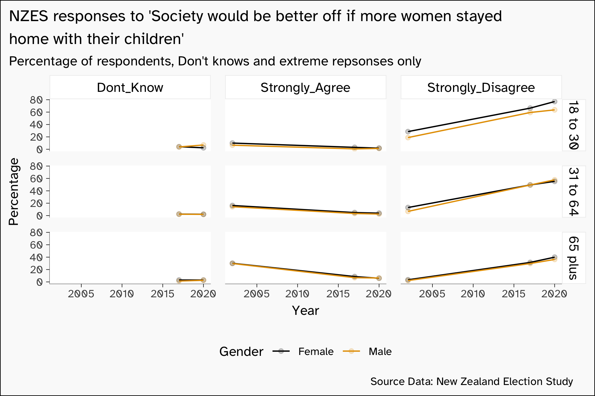

While there is a big change, it is all in the same direction, and shared
by all ages and genders.
